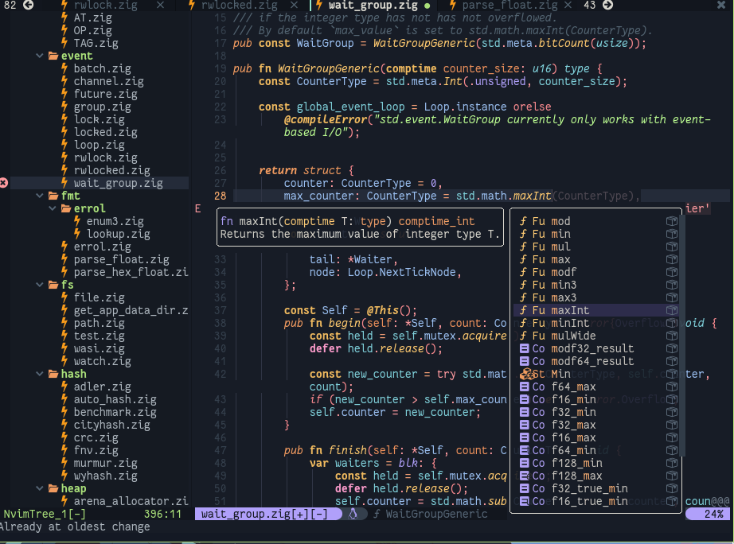

# cyu.lua 

<div align="center">
    
</div>

<hr/>
<br/><br/>
<big>A simple, darker, ayu-based colorscheme for Neovim in particular, and a few other Terminal-based and GUI editors.</Big>
<br/><br/>
<hr/>

- For history buffs, this is a Neovim theme in Lua which roughly follows the ayu colorset while trying to make the extra Treesitter parsing show all the colors I believe it is truly worth, for all the wonderful plugins it's worth. I hope all the goofy and weird color coverage is worth it! I use it!
- It's an ayu-based them, intended to be a personal theme I can continually modify and tweak over time. The repo itself is almost fully based on the (excellent) [tokyonight.nvim][tokyonight] theme and Github repo. The cuurrent end-product is something which looks vaguely colorful and resembles its inspiration Ayu ever-so-vaguely... I think?


## Installation
- Installation and configuration are near identical to tokyonight at the moment, but not all flavors or color palette variations are implemented yet. Still, installation instructions remain the same.

- If you're using [packer.nvim][packer], just copy this code into wherever you keep your packer startup function:

```lua
use "clpi/cyu.lua"
```
- **Note**: This theme only works in NeoVim (preferably, the latest stable version) for now. However, a vim version should be an easy task.


## Configuration
- Configuration is borrowed from tokyonight.nvim (as an artefact of using its repo as a base template), however no different color variations have been made, so, for the time being, configuration options have been made available to the end user to provide them an illusory feeling of power and control.
- This can be achieved through the Lua API (in Neovim 0.5+):_
```lua
use  { 
    "clpi/cyu.lua",
    config = function()
        vim.g.cayu_style = "night" -- Only palette variant available right now
        vim.g.cayu_italic_functions = true
        vim.g.cayu_sidebars = {}  -- Specify window types to shade differentially
    end
}
-- ... (after packer startup) ...
vim.cmd[[ colorscheme cayu ]]
    
```


## Plugin Support

- Supports custom coloring of many themes, including all of those supported by tokyonight as well as several custom additions. A few listed:
    - [nvim-treesitter]()
    - [trouble.nvim]()
    - [telescope.nvim]()
    - [vimwiki]()
    - [neogit.nvim]()
    - [bufferline.nvim]()
    - [copilot.vim](https://github.com/github/copilot.vim.git)
    - [gitsigns.nvim]()
    - [indent-blankline.nvim]()
    - [cmp-nvim]()
    - [fzf-lua]()
    - [toggleterm-nvim]()
    - [lualine]()
    - [lightline]()
    - ...and friends


## Misc

- If you have any [issues][issues] or want any particular plugin supported please feel free to [reach out][issues]!

- Looking to try to bring my brand of ayu-inspired flavorings to all other sorts of programs in neat fancy packages, maybe it won't be just me excited for that small fact! 
<div align="center">
    
</div>

<div align="center">
    
</div>

  [issues]: https://github.com/grantwinney/BlogCodeSamples/issues
  [tokyonight]: https://github.com/folke/tokyonight.nvim
  [packer]: https://github.com/wbthomason/packer.nvim
